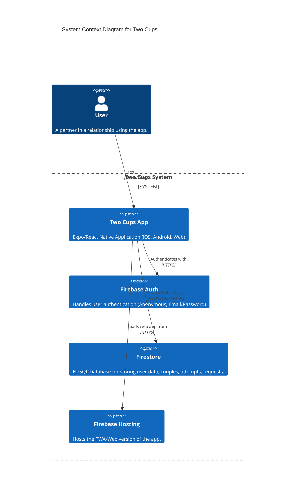

# System Context

This diagram shows the system context for the Two Cups App.

```mermaid
C4Context
    title System Context Diagram for Two Cups

    Person(user, "User", "A partner in a relationship using the app.")

    System_Boundary(twocups, "Two Cups System") {
        System(mobileApp, "Two Cups App", "Expo/React Native Application (iOS, Android, Web)")

        System(firebaseAuth, "Firebase Auth", "Handles user authentication (Anonymous, Email/Password)")
        System(firestore, "Firestore", "NoSQL Database for storing user data, couples, attempts, requests.")
        System(hosting, "Firebase Hosting", "Hosts the PWA/Web version of the app.")
    }

    Rel(user, mobileApp, "Uses", "Touch/Click")
    Rel(mobileApp, firebaseAuth, "Authenticates with", "HTTPS")
    Rel(mobileApp, firestore, "Reads/Writes data", "HTTPS/WebSockets")
    Rel(mobileApp, hosting, "Loads web app from", "HTTPS")

    UpdateLayoutConfig($c4ShapeInRow="3", $c4BoundaryInRow="1")
```
